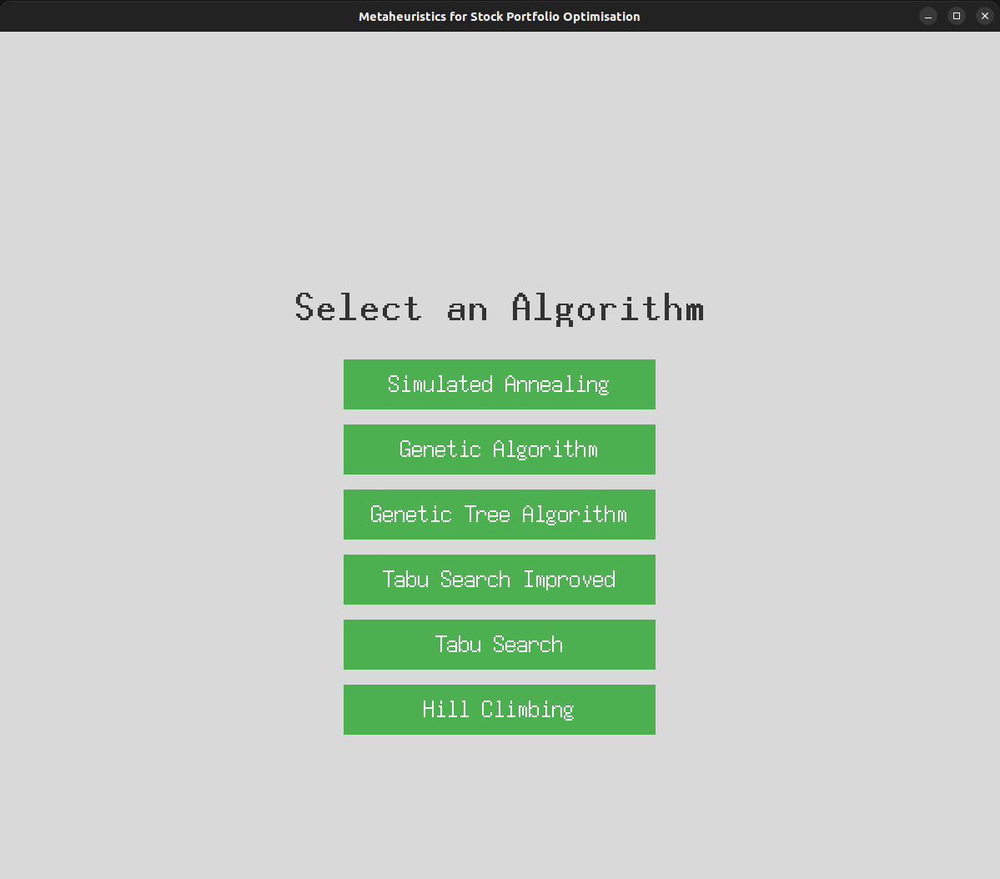

# Stock Portfolio Optimization with Metaheuristics

## Project Description

This project is part of the first practical assignment of the **Artificial Intelligence** course (**3rd Year, 2nd Semester**). The main goal is to solve an optimization problem using various metaheuristic algorithms. Specifically, the chosen problem is **Stock Portfolio Optimization**, where the objective is to optimize the selection of stocks to maximize returns while minimizing risks. The dataset used for this purpose is sourced from [Australian Historical Stock Prices](https://www.kaggle.com/datasets/ashbellett/australian-historical-stock-prices).

The application implements multiple algorithms to solve the problem, compares their performance, and provides a graphical user interface for visualization and interaction.

## Implemented Algorithms

The following algorithms have been implemented to solve the optimization problem:

1. **Hill Climbing**: A local search algorithm that iteratively moves to a better neighboring solution until no better neighbors are found.
2. **Simulated Annealing**: A probabilistic technique that explores the solution space by allowing worse solutions to be accepted with a decreasing probability.
3. **Tabu Search**: An advanced local search algorithm that uses memory structures to avoid revisiting recently explored solutions.
4. **Genetic Algorithms**: Inspired by natural selection, this algorithm uses a population of solutions and applies crossover and mutation to evolve better solutions over generations.
   - **Simple Genetic Algorithm**: A basic implementation of the genetic algorithm.
   - **Tree-Based Genetic Algorithm**: A variation that uses tree structures to represent solutions.

Each algorithm has been parameterized and tested on multiple instances of the problem with varying sizes and complexities. The results include solution quality, computation time, and the evolution of the solution over iterations.

## How to run

- Create a virtual python environment and activate it
```
python -m venv myenv
source myenv/bin/activate
```

- Install the dependencies
```
pip install -r requirements.txt
```

- Run the script (You must ensure there is a reliable internet connection as the script downloads the dataset from kaggle)
```
python main.py
```

- Then you just have to select the algorithm you desire to explore and give the asked inputs. Apart from the graphs in the UI, the results can also be consulted in a generated CSV file.



## Authors

- **Gonçalo Marques** – [up202206205@up.pt](mailto:up202206205@up.pt)
- **Miguel Guerrinha** – [up202205038@up.pt](mailto:up202205038@up.pt)
- **Rui Cruz** – [up202208011@up.pt](mailto:up202208011@up.pt)
